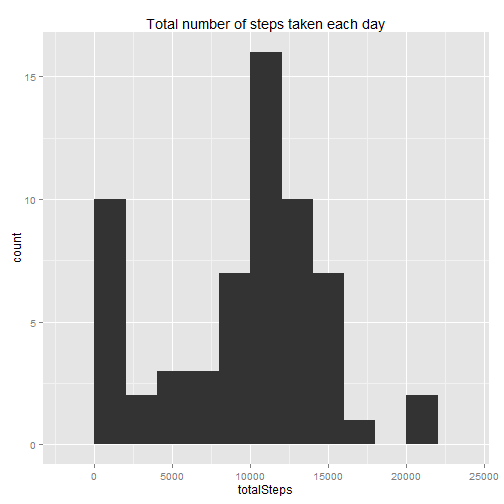
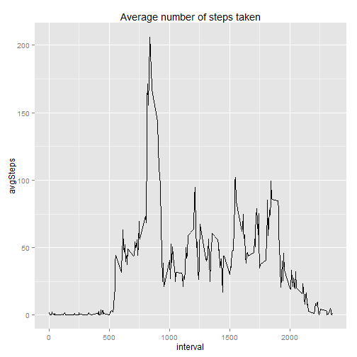
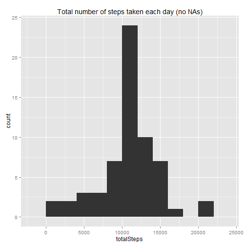
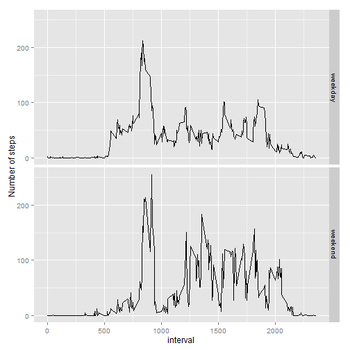

First Assigment of Coursera Reproducible Research course


### Loading and preprocessing the data
In this section the data is extracted/read and the required libraries are loaded

```r
# Changing locale so the weekdays match the result required (eg: Thu, Fri, Sat, etc)
Sys.setlocale("LC_TIME", "English")
```

```
## [1] "English_United States.1252"
```

```r
library(dplyr, warn.conflicts = FALSE)
library(ggplot2, warn.conflicts = FALSE)

if (!dir.exists("data")) {
    unzip("activity.zip", exdir = "data")
}
data <- read.csv("data/activity.csv")
```


### What is mean total number of steps taken per day?

```r
totalByDay <- data %>% 
    group_by(date) %>% 
    summarise(totalSteps = sum(steps, na.rm = T))

ggplot(totalByDay, aes(totalSteps)) +
    geom_histogram(binwidth = 2000) +
    labs(title = "Total number of steps taken each day")
```

 

Mean and Median of the total steps per day:

```r
mean(totalByDay$totalSteps); median(totalByDay$totalSteps)
```

```
## [1] 9354.23
```

```
## [1] 10395
```

### What is the average daily activity pattern?

```r
meanByInterval <- data %>%
    group_by(interval) %>%
    summarise(avgSteps = mean(steps, na.rm = T))

ggplot(meanByInterval, aes(interval, avgSteps)) +
    geom_line() +
    labs(title = "Average number of steps taken")
```

 

Maximun number of averaged steps:

```r
meanByInterval[which.max(meanByInterval$avgSteps), ]
```

```
## Source: local data frame [1 x 2]
## 
##   interval avgSteps
##      (int)    (dbl)
## 1      835 206.1698
```

### Imputing missing values
Total number of NAs:

```r
sum(is.na(data))
```

```
## [1] 2304
```

Replace NAs with the average of the interval

```r
noNaData <- data
noNaData[is.na(data),]$steps <- round(meanByInterval[meanByInterval$interval == data[is.na(data),]$interval]$avgSteps)

totalByDayNoNA <- noNaData %>% 
    group_by(date) %>% 
    summarise(totalSteps = sum(steps))
ggplot(totalByDayNoNA, aes(totalSteps)) +
    geom_histogram(binwidth = 2000) +
    labs(title = "Total number of steps taken each day (no NAs)")
```

 

```r
mean(totalByDayNoNA$totalSteps); median(totalByDayNoNA$totalSteps)
```

```
## [1] 10765.64
```

```
## [1] 10762
```

Now the mean is close to the median.

### Are there differences in activity patterns between weekdays and weekends?

```r
noNaData <- noNaData %>% 
    mutate(day = factor(ifelse(grepl( "S(at|sun)", weekdays(as.POSIXct(date, "%Y-%m-%d"), abbreviate = T)), 
                        "weekend", 
                        "weekday")))

meanByInterval <- noNaData %>%
    group_by(interval, day) %>%
    summarise(avgSteps = mean(steps))

ggplot(meanByInterval, aes(interval, avgSteps)) +
    geom_line() + 
    labs(y = "Number of steps") +
    facet_grid(day ~ .)
```

 
